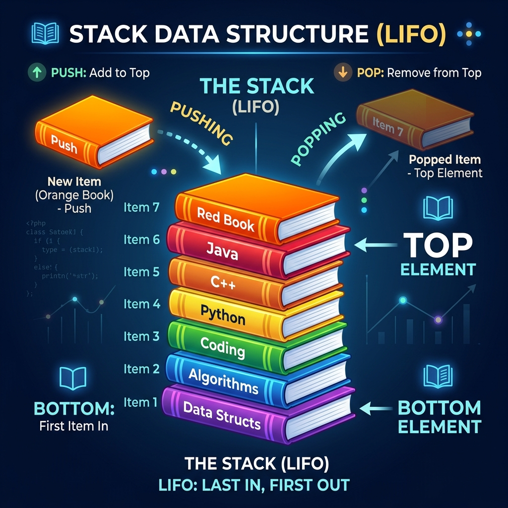

<!-- +------------------------------------------+ -->
<!-- |  STACK — LAST IN, FIRST OUT (LIFO)       | -->
<!-- +------------------------------------------+ -->
# Stack — Last In, First Out (LIFO)

## What is a Stack?

Think of a **stack of dinner plates**.

- When you wash a plate, you place it on **TOP** of the pile.
- When you need a plate, you take the one from the **TOP**.
- You **never** pull a plate from the middle — everything above it would crash!

> **Simple Definition:** A Stack is a data structure where the **last item added** is always the **first item removed**. This rule is called **LIFO — Last In, First Out**.

---

## The Two Main Operations

| Operation | What it Does | Real-Life Analogy |
|---|---|---|
| **PUSH** | Add a new item to the **TOP** | Place a plate on top of the pile |
| **POP** | Remove the item from the **TOP** | Take a plate from the top of the pile |

---

## 🖼️ Visual Representation

> [!NOTE]
> **Teacher's Perspective:** "Think of a **Stack of Cafeteria Trays** or a tall pile of books! You want to add a tray? You place it on the very **TOP** (Push). You want to use a tray? You take it from the very **TOP** (Pop). You'd never pull one from the middle, or the whole stack would crash! This simple rule is called **LIFO**—Last In, First Out."

---

## 🎓 Step-by-Step Breakdown (Teacher's Guide)

Let's build a stack using the numbers `[10, 20, 30, 40]`:

### 1. Building Up (The "Push" Phase)
- **Push 10:** We start with one number on the bottom.
- **Push 20:** We place 20 right on top of 10.
- **Push 30:** 30 goes on top of 20.
- **Push 40:** Now 40 is at the very top. It's the first one we'd see!

### 2. Tearing Down (The "Pop" Phase)
Since we can only take from the top, look at what happens when we remove items:
1. **Pop:** We take 40 off the top.
2. **Pop:** Now 30 is at the top, so we take it.
3. **Pop:** 20 is next.
4. **Pop:** Finally, we take 10. The stack is empty!

---

## 🧠 Why is this so useful?
The Stack is the "Memory King" of your computer. Every time you press **Undo (Ctrl+Z)**, your computer is just "Popping" your last action off a stack! Every time you click the **Back Button** in your browser, you're popping the current page to reveal the one underneath it.

---

Notice: Items come out in **REVERSE** order! We pushed 10, 20, 30, 40 — and they pop out as 40, 30, 20, 10.

---

## Where Are Stacks Used in Real Life?

| Use Case | How Stack Works |
|---|---|
| **Undo button** (Ctrl+Z) | Your last action is on top. Pressing Undo removes it (pops). |
| **Browser Back button** | Every page you visit is pushed. Clicking Back pops the current page. |
| **Function calls in programs** | When a function calls another function, the computer "pushes" it. When it finishes, it "pops" back. |

---

## Key Takeaways

1. A Stack follows the **LIFO** rule — Last In, First Out
2. You can only touch the **TOP** — no peeking at the middle!
3. **PUSH** = Add to the top, **POP** = Remove from the top
4. Items come out in **reverse order** from how they went in
5. Stacks are used everywhere: Undo history, browser back, function calls
