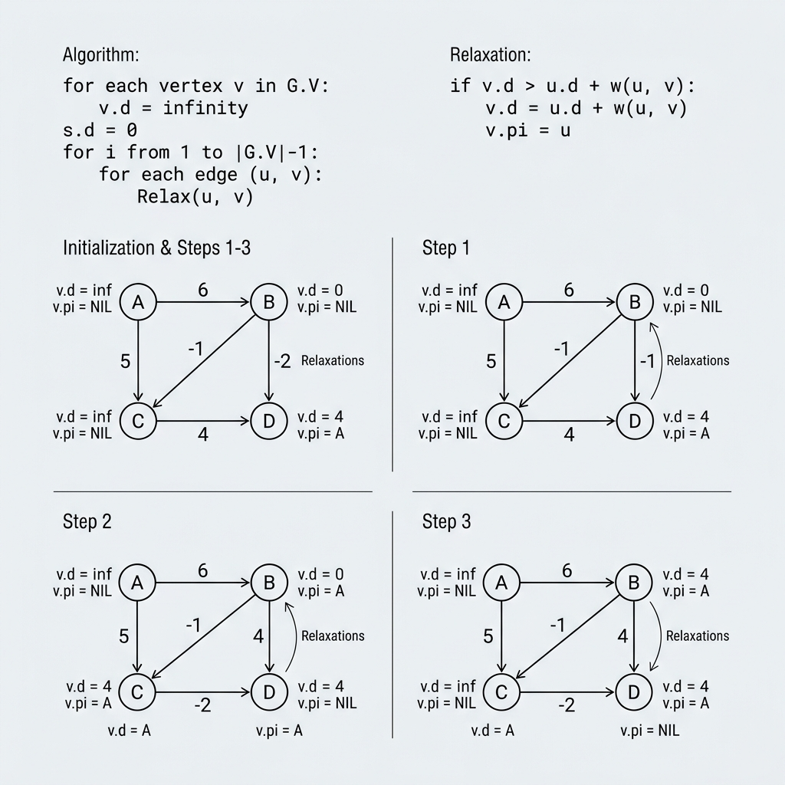

<!-- +----------------------------------------------------------+ -->
<!-- |  BELLMAN-FORD — THE NEGATIVE WEIGHT SPECIALIST           | -->
<!-- +----------------------------------------------------------+ -->
# Bellman-Ford Algorithm — The Negative Weight Specialist

## What is Bellman-Ford?

Remember Dijkstra's Algorithm? It finds the shortest path, but it **panics** if any road has a **negative weight** (like a road that *pays you* to drive on it!).

**Bellman-Ford** is the slower but **smarter** brother. It CAN handle negative weights AND it can **detect infinite money loops** (negative cycles)!

### ⚖️ The Golden Rule of Negatives
- **Negative Weights?** YES ✅! It is specifically designed to handle roads that "pay you" to drive on them.
- **Negative Cycles?** NO ❌. If a loop's total sum is negative, there is no "shortest" path (you'd loop forever!). Bellman-Ford will detect this and sound an alarm.

> **Simple Definition:** Bellman-Ford finds the shortest path to all nodes by repeatedly checking every edge. It works perfectly with negative weights and identifies when a negative cycle makes a solution impossible.

---

## 🖼️ Visual Representation



> [!NOTE]
> **Teacher's Perspective:** "Remember our smart GPS, Dijkstra? He's great, but he **panics** if a road actually *pays you* to drive on it (a negative weight). **Bellman-Ford** is the slower but much **smarter** brother. He doesn't just look for the cheapest road; he patiently checks *every single road* multiple times to find the absolute best deal, even if it involves those tricky negative weights. And most importantly, he's a detective—he can spot **Infinite Loops** (negative cycles) where you could drive in a circle forever and keep 'earning' money!"

---

## 🎓 Step-by-Step Breakdown (Teacher's Guide)

Let's see how Bellman-Ford solves a graph with 5 houses (Nodes 0-4):

### 1. The Patient Observer (Iteration)
Bellman-Ford is very thorough. If there are 5 houses, he knows the longest possible path without going in circles is 4 steps long. So, he performs **4 full rounds** (iterations) of checking every single road in town.

### 2. Checking the Roads
In each round, he looks at every road: "If I take this road from House A to House B, is it cheaper than the way I already know?"
- At first, he only knows House 0 (cost 0).
- In Round 1, he discovers House 1 and Node 2.
- In Round 2, he uses the new info about 1 and 2 to find House 3.
- He keeps doing this until everyone has the best possible price.

### 3. The "Infinite Money" Warning (Negative Cycle)
After finishing his 4 rounds, he does **one final check**. If he finds *yet another* shortcut, he knows something is wrong! 
- **The Mystery:** "Wait, I already checked every path! If it's *still* getting cheaper, there must be a loop that subtracts cost every time I go around it!"
- **The Result:** He sounds an alarm: **"Negative Cycle Found!"** This is how banks find "arbitrage" loops in currency exchange!

---

### INITIALIZATION: Everything starts at infinity

```
  +------+----------+
  | Node | Distance |
  +------+----------+
  |  0   |    0     |  < Start
  |  1   |    ∞     |
  |  2   |    ∞     |
  |  3   |    ∞     |
  |  4   |    ∞     |
  +------+----------+
```

### ITERATION 1 (of n-1 = 4 iterations): Check ALL edges

```
  Check edge (0>1, cost 4):  dist[0] + 4 = 0 + 4 = 4  < ∞   > UPDATE dist[1] = 4 ✅
  Check edge (0>2, cost 2):  dist[0] + 2 = 0 + 2 = 2  < ∞   > UPDATE dist[2] = 2 ✅
  Check edge (1>2, cost 1):  dist[1] + 1 = 4 + 1 = 5  > 2   > No change
  Check edge (1>3, cost 5):  dist[1] + 5 = 4 + 5 = 9  < ∞   > UPDATE dist[3] = 9 ✅
  Check edge (2>3, cost 8):  dist[2] + 8 = 2 + 8 = 10 > 9   > No change
  Check edge (2>4, cost 10): dist[2] + 10= 2 + 10= 12 < ∞   > UPDATE dist[4] = 12 ✅
  Check edge (3>4, cost 2):  dist[3] + 2 = 9 + 2 = 11 < 12  > UPDATE dist[4] = 11 ✅

  +------+----------+
  | Node | Distance |
  +------+----------+
  |  0   |    0     |
  |  1   |    4     |
  |  2   |    2     |
  |  3   |    9     |
  |  4   |   11     |
  +------+----------+
```

### ITERATION 2: Check ALL edges again

```
  Check edge (0>1, cost 4):  0 + 4 = 4  = 4   > No change
  Check edge (0>2, cost 2):  0 + 2 = 2  = 2   > No change
  Check edge (1>2, cost 1):  4 + 1 = 5  > 2   > No change
  Check edge (1>3, cost 5):  4 + 5 = 9  = 9   > No change
  Check edge (2>3, cost 8):  2 + 8 = 10 > 9   > No change
  Check edge (2>4, cost 10): 2 + 10= 12 > 11  > No change
  Check edge (3>4, cost 2):  9 + 2 = 11 = 11  > No change

  No changes! Algorithm has converged. ✅
  (We still run remaining iterations as a formality)
```

### FINAL DISTANCES:
```
  +------+----------+--------------------------+
  | Node | Distance | Shortest Path            |
  +------+----------+--------------------------+
  |  0   |    0     | Start                    |
  |  1   |    4     | 0 > 1                    |
  |  2   |    2     | 0 > 2                    |
  |  3   |    9     | 0 > 1 > 3                |
  |  4   |   11     | 0 > 1 > 3 > 4            |
  +------+----------+--------------------------+
```

## 🧠 Why is it slower than Dijkstra?
Dijkstra is "Greedy"—he picks one house and is done with it. Bellman-Ford is "Persistent"—he checks every house, over and over, just to be 100% sure about those negative weights. It's the difference between a quick guess and a deep investigation!

---


---

## Dijkstra vs Bellman-Ford

| Feature | Dijkstra | Bellman-Ford |
|---|---|---|
| **Speed** | O((V+E) log V) — Fast | O(V × E) — Slower |
| **Negative weights?** | ❌ Cannot handle | ✅ Works perfectly |
| **Negative cycle detection?** | ❌ No | ✅ Yes! |
| **Strategy** | Greedy (pick cheapest) | Brute force (check all edges repeatedly) |

---

## Where is Bellman-Ford Used?

| Use Case | How It Helps |
|---|---|
| **Financial Arbitrage** | Finding currency exchange loops that make profit (negative cycle!) |
| **Internet Routing (RIP)** | Routers use distance-vector protocol based on Bellman-Ford |
| **Games** | Finding paths where some tiles give bonuses (negative weights) |

---

## Key Takeaways

1. Bellman-Ford relaxes **ALL edges**, repeated **(n-1) times**
2. It works with **negative edge weights** (unlike Dijkstra!)
3. It can **detect negative cycles** — infinite loops with decreasing cost
4. It's **slower** than Dijkstra but more **versatile**
5. Why n-1 times? Because the longest simple path has at most n-1 edges
