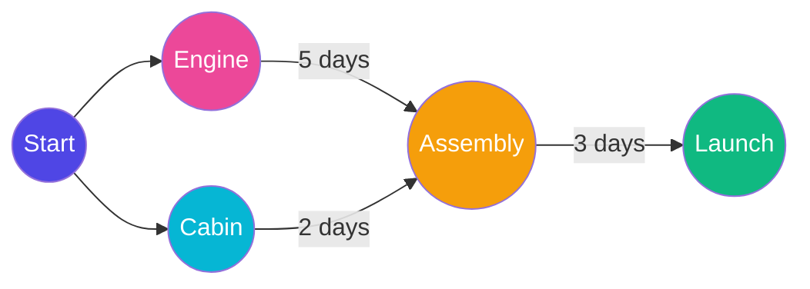

<!-- +------------------------------------------------------+ -->
<!-- |  LONGEST PATH IN DAG — THE CRITICAL PATH METHOD      | -->
<!-- +------------------------------------------------------+ -->

# Longest Path in DAG — The Critical Path Method

## Theoretical Definition & Comparisons

**Theoretical Definition:** 
The Longest Path / Shortest Path in a DAG algorithm utilizes the acyclic nature of the graph to find optimal paths in strictly linear time $O(V+E)$. It first sorts the graph topologically, then processes each node forward, passing its distances to neighbors.

**Context & Comparison:**
*   **Longest Path (DAG):** Highly efficient because it evaluates nodes perfectly in dependency order. Solves the scheduling critical-path problem.
*   **Dijkstra / Bellman-Ford:** Standard shortest-path algorithms are completely unnecessary in a DAG. Bellman-Ford is $O(VE)$ and Dijkstra is $O(E \log V)$, whereas DAG traversal achieves $O(V+E)$ linearly and handles negative edge weights naturally without infinite looping.

---

## What is the Longest Path?

Imagine you're **building a spaceship**. There are many tasks to complete: build the engine, wire the electronics, assemble the cabin, paint the exterior. Some tasks can happen **at the same time**, but many must **wait** for others.

The **Longest Path** through this dependency map tells NASA exactly how long the **entire project** will take. Even if some tasks finish early, the project isn't done until the **longest chain** of dependent tasks is complete!

> **Simple Definition:** The Longest Path in a DAG (Directed Acyclic Graph) finds the **maximum number of steps** needed to reach each node from the starting points.

---## Visual Representation



> [!NOTE]
> **Teacher's Perspective:** "Imagine you're **building a spaceship** for NASA. You have a hundred tasks, and many of them can happen at the same time. But here's the catch: You can't finish the spaceship until the **longest chain** of dependent tasks is done. If the Engine takes 10 days and the Cabin takes 2 days, your 'Critical Path' is 10 days long. Even if you finish the Cabin early, the spaceship isn't flying until that Engine is ready! **Longest Path in DAG** helps us find exactly which tasks are 'Critical' and will delay the entire mission if they fall behind."

---

## Step-by-Step Breakdown (Teacher's Guide)

Let's find the Critical Path for our Spaceship:

### 1. The Dependencies (Topological Order)

First, we arrange our tasks in a "Legal Order" (using Topological Sort). This ensures we never try to assemble the spaceship before we've built the engine.

### 2. Tracking the Time (Dynamic Programming)

We start at the beginning of our timeline (Time = 0). For every task we reach, we look at where it came from:

- **The Calculation:** `My Completion Time = Maximum of (Prerequisite's Time + My Duration)`
- We use **MAXIMUM** because we must wait for the _last_ prerequisite to finish before we can start.

### 3. Finding the Bottleneck

By the time we've checked every task, the house with the largest time on the scoreboard is our **Longest Path**. This is the absolute minimum time it will take to finish the entire project!

---

---

## Steps to Perform (Visual Trace)

Let's find the **Critical Path** for building our Spaceship.
**Tasks:** A (Start), B (Build Engine: 5d), C (Build Cabin: 2d), D (Assemble: 3d).

### 1. Initial State (Time 0)
Everyone starts at 0.
```text
(A) [0] --(5d)--> (B) [0]
 |                 |
(2d)              (3d)
 |                 v
(C) [0] ----------(D) [0]
```

### 2. Propagation: Finishing A
A is done. We look at B and C.
- **B:** $0 + 5 = 5$
- **C:** $0 + 2 = 2$
```text
[A]* --(5d)--> (B) [5]
 |               |
(2d)            (3d)
 |               v
(C) [2] --------(D) [0]
```

### 3. Propagation: Assembly (D)
Task D must wait for BOTH B and C.
- From B: $5 + 3 = 8$
- From C: $2 + 3 = 5$
- **Rule:** We pick the **MAX**. So D is ready at Day 8!
```text
[B]* --(3d)--> [D]* [8] ✅ (Max of 5 and 8)
                ^
[C]* -----------|
```

### 4. Conclusion
The longest path is `A -> B -> D` (Total: 8 days). This is our **Critical Path**. Even though the Cabin (C) finished in 2 days, the whole project takes 8 days!

---

## Why "Longest" instead of "Shortest"?

In a graph like Google Maps, we want the shortest path to save time. But in project management, the **Longest Path** represents the **Bottleneck**. It tells you: 'This is the fastest you can possibly go, because you're tied to your slowest dependency.'

---

4.

```

### Visual of Depths:
```

Depth 0: 0 1
| |
Depth 1: 2 3 4
|
Depth 2: 5
|
Depth 3: 6
|
Depth 4: 7 < The project's total "length"!

```

---

## Where is Longest Path Used?

| Use Case | How It Helps |
|---|---|
| **Critical Path Method (CPM)** | Finding the minimum time to finish a construction project |
| **Project Management** | Identifying which tasks will delay the whole project if delayed |
| **Game Tech Trees** | How deep is a technology tree in a strategy game? |
| **Compiler optimization** | Determining the longest chain of dependent operations |

---

## Key Takeaways

1. Combines **Topological Sort + Dynamic Programming**
2. The longest path determines the **minimum project completion time**
3. Uses the formula: `depth[neighbor] = MAX(depth[neighbor], depth[current] + 1)`
4. **MAX** ensures we always keep the **longest** path (not the shortest!)
5. A task on the critical path **cannot be delayed** without delaying the whole project
6. Only works on **DAGs** — no cycles allowed!
```
