<!-- +------------------------------------------------------+ -->
<!-- |  INTERVAL SCHEDULING — THE MEETING ROOM PROBLEM      | -->
<!-- +------------------------------------------------------+ -->

# Interval Scheduling — The Meeting Room Problem

## What is Interval Scheduling?

Imagine you have **one meeting room** and **8 friends** all want to use it. Each friend has a **start time** and an **end time** for their meeting. Your goal is simple: **fit as many meetings as possible** into that one room without any overlap!

> **Simple Definition:** Given a list of tasks (each with a start time and end time), pick the **maximum number** of non-overlapping tasks.

---

## 🖼️ Visual Representation

```mermaid
gantt
    title Optimal Meeting Schedule
    dateFormat  X
    axisFormat %s
    section Booked
    Meeting A (End: 4) :active, 1, 4
    Meeting D (End: 7) :active, 5, 7
    Meeting H (End: 11) :active, 10, 11
    section Rejected
    Meeting B (Overlaps A) :crit, 3, 5
    Meeting C (Overlaps A) :crit, 0, 6
```

> [!NOTE]
> **Teacher's Perspective:** "Think of yourself as a **Busy Hotel Manager** 🏨. You only have one grand ballroom, and everyone wants to host their party there. You want to host the _most_ parties possible to make your customers happy. The secret isn't picking the shortest party or the one that starts first. The trick is to always pick the party that **FINISHES earliest**. Why? Because the sooner a party ends, the sooner your room is free to host the next one!"

---

## 🎓 Step-by-Step Breakdown (Teacher's Guide)

Let's book our ballroom like a pro:

### 1. The Super-Sort (The Finish Line)

First, we look at all the requests and sort them by their **End Time**.

- We don't care when they start; we only care about who finishes first!

### 2. The First Booking

We always pick the very first meeting on our sorted list (the one that ends the earliest in the whole day).

- We book it! Now we note down the time the room becomes free again.

### 3. The "Next Available" Rule

We look at the next meeting on our list:

- **Rule:** If it starts _after_ (or exactly when) the last meeting ended, **Book it!**
- If it starts _before_ the last meeting ended, it overlaps. **Skip it!**

### 4. Repeat until Done

We keep going down the list until we've checked every request. Because we always picked the one that ended earliest, we've left the "maximum possible time" remaining for all future requests!

---

## 🧠 Why is "Earliest End" the Winner?

If you pick the _shortest_ meeting, it might start in the middle of two others and block both. If you pick the one that _starts first_, it might be 10 hours long and block the whole day!

By picking the one that **ends first**, you are being "Greedy" for **Future Time**. You're freeing up your resources as fast as humanly possible!

---

## Real-Life Examples

| Scenario                | How Greedy Scheduling Helps                           |
| ----------------------- | ----------------------------------------------------- |
| **Hospital Consultant** | Fit the most patient appointments in a shift          |
| **Conference Room**     | Schedule the most presentations without overlap       |
| **TV Broadcasting**     | Choose which shows to air to fill the most time slots |
| **Job Scheduling**      | Assign the most jobs to a single machine              |

---

## Key Takeaways

1. **Sort by end time** (earliest first)
2. **Pick greedily** — if a meeting starts after the room is free, take it!
3. This gives the **maximum number** of non-overlapping meetings
4. Time complexity: **O(n log n)** (just the sorting step!)
5. This is mathematically **proven** to be the optimal strategy
