<!-- +----------------------------------------------------------+ -->
<!-- |  MINIMIZE LATENESS — THE BAKER'S DEADLINE PROBLEM         | -->
<!-- +----------------------------------------------------------+ -->

# Minimize Lateness — The Baker's Deadline Problem

## What is the Minimize Lateness Problem?

Imagine a **busy baker** 👩‍🍳 with 5 wedding cake orders. Each cake takes a few hours to decorate, and each has a strict delivery deadline. You want to be a fair baker: even if some cakes will be a bit late, you want to organize them so that the **most delayed** cake is only late by a **minimum amount**. You're minimizing the "worst-case scenario" for your customers!

> **Simple Definition:** Given tasks with durations and deadlines, arrange them so the **maximum lateness** across all tasks is as small as possible.

---

## 🖼️ Visual Representation

```mermaid
gantt
    title Optimal Baker's Schedule
    dateFormat  X
    axisFormat %s
    section Tasks
    Cake 1 (Deadline: 6) :active, 0, 3
    Cake 3 (Deadline: 8) :active, 3, 4
    Cake 2 (Deadline: 9) :active, 4, 6
    Cake 4 (Deadline: 9) :crit, 6, 10
    Cake 5 (Deadline: 14) :active, 10, 13
    Cake 6 (Deadline: 15) :active, 13, 15
```

> [!NOTE]
> **Teacher's Perspective:** "Imagine you have **homework** due tomorrow and a **large project** due in two weeks. Even if the project is huge and important, you should tackle the homework first! Why? Because the homework's deadline is breathing down your neck. **Minimize Lateness** tells us the most logical thing in the world: **Handle the most URGENT thing first!** By following the Earliest Deadline, you're making sure that if _anyone_ is late, they're only late by a tiny bit, rather than one person being hours behind."

---

## 🎓 Step-by-Step Breakdown (Teacher's Guide)

Let's save our bakery from angry customers:

### 1. The Urgency Sort (Earliest Deadline)

First, we look at all our orders and sort them by their **Deadline**.

- We don't care how long the cake takes to bake yet; we only care about who needs it _first_.

### 2. The Non-Stop Workflow

We start baking at Time = 0. We pick the cake with the soonest deadline and bake it until it's done.

- We then pick the next cake on our sorted list and start it immediately.
- **No Breaks:** We keep going until every cake is finished.

### 3. Checking the "Lateness" Scoreboard

For every cake, we check: `Finish Time - Deadline`.

- If the result is positive (e.g., +1), the cake is **1 hour late**.
- If it's zero or negative, the cake is **On Time!**

### 4. The Result

By sorting by the **Earliest Deadline**, we have mathematically ensured that the largest "Lateness" number on our scoreboard is the absolute minimum it could possibly be.

---

## 🧠 Why not the "Shortest Cake" First?

If you bake the shortest cake first, you might ignore a long, urgent cake until its deadline has already passed by miles! Sorting by **Deadline** is the only way to be fair to every customer's timeline.

---

## Where is This Used?

| Use Case                    | How It Helps                                              |
| --------------------------- | --------------------------------------------------------- |
| **Factory production**      | Minimize the worst-case delay among all orders            |
| **Hospital Emergency Room** | Prioritize patients by urgency (deadline = critical time) |
| **Homework/Assignments**    | Do the one due soonest first to minimize late penalties   |
| **Construction Projects**   | Schedule sub-tasks to minimize worst delay                |

---

## Key Takeaways

1. **Sort tasks by deadline** (earliest first) — this is the greedy strategy
2. **Lateness** = Finish Time − Deadline (negative means on time!)
3. The goal is to minimize the **MAXIMUM** lateness, not the average
4. This strategy is **mathematically proven** to be optimal
5. Time complexity: **O(n log n)** — just the sorting step!
6. Think of it as: "Handle the most urgent thing first!"
