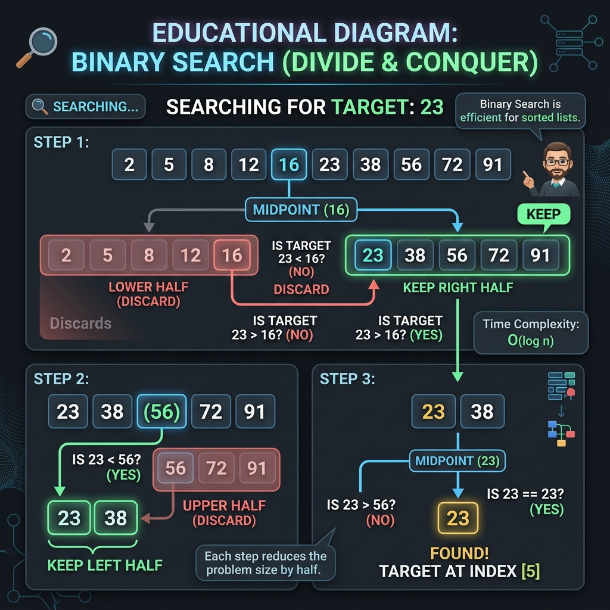

<!-- +------------------------------------------+ -->
<!-- |  BINARY SEARCH — THE PHONEBOOK METHOD    | -->
<!-- +------------------------------------------+ -->
# Binary Search — The Phonebook Method

## What is Binary Search?

Imagine you're looking for a name in a **thick phone book**. Would you start at page 1 and read every single name? Of course not!

You'd open the book **in the middle**. If the name you want comes before the middle page, you flip to the **left half**. If it comes after, you flip to the **right half**. You keep halving until you find the name!

> **Simple Definition:** Binary Search is a super-fast way to find a number in a **sorted list** by cutting the search area in **half** with each step.

> **Critical Rule:** The list MUST be sorted first! Binary Search doesn't work on messy lists.

---

## 🖼️ Visual Representation



> [!NOTE]
> **Teacher's Perspective:** "Imagine you're looking for a name in a thick phone book. You don't start at page 1, right? You open it to the **Middle**. If the name starts with 'S' and the middle page is 'M', you know for a fact that 'S' must be in the second half. You just **threw away half the book** in one second! You keep doing this until you're looking at the exact name you want."

---

## 🎓 Step-by-Step Breakdown (Teacher's Guide)

Let's find the number **23** in this sorted list: `[2, 5, 8, 12, 16, 23, 38, 56, 72, 91]`

### Step 1: The First Cut
- we look at the whole list (10 items).
- The **Middle** is 16.
- **Question:** Is 16 the same as 23? **No.**
- **Decision:** 16 is smaller than 23, so our target must be in the **Right Half**.
- **Action:** Throw away all numbers from 16 to the left!

### Step 2: The Second Cut
- Now we only care about: `[23, 38, 56, 72, 91]`.
- The **Middle** of this new group is 56.
- **Question:** Is 56 the same as 23? **No.**
- **Decision:** 56 is bigger than 23, so our target must be in the **Left Half** of this group.
- **Action:** Throw away 56 and everything to its right!

### Step 3: Success!
- Now we're looking at: `[23, 38]`.
- The **Middle** calculation lands us right on 23.
- **Result:** **FOUND IT!** 23 is at index 5.

---

## 🧠 Why is it so fast?
Binary Search is like a superpower. Every time you make a comparison, you **destroy half the problem**. Even if you had a list of **one billion** items, you would find your target in only **30 steps**!

---

## Two Ways to Write Binary Search

### Iterative (Using a While Loop)

```
  Start --> Calculate Middle --> Compare --> Adjust boundaries --> Repeat
                 ^                                                    |
                 +----------------------------------------------------+
                               (Loop until found or empty)
```

### Recursive (Function Calls Itself)

```
  search([2,5,8,12,16,23,38,56,72,91], target=23, start=0, end=9)
         |
         +--> middle=4, value=16, 16 < 23 > search RIGHT
         |
         +--> search([...], target=23, start=5, end=9)
                   |
                   +--> middle=7, value=56, 56 > 23 > search LEFT
                   |
                   +--> search([...], target=23, start=5, end=6)
                             |
                             +--> middle=5, value=23 == 23 > FOUND! ✅
```

Both methods give the **same result**. The recursive version calls itself with a smaller range each time.

---

## Linear Search vs Binary Search

```
  LINEAR SEARCH (One by one):
  Check 2? No. Check 5? No. Check 8? No. Check 12? No. Check 16? No. Check 23? YES!
  -->-->-->-->-->-->
  (6 checks!)

  BINARY SEARCH (Halving):
  Middle=16? Too small, look right. Middle=56? Too big, look left. Middle=23? YES!
  (Only 3 checks!)
```

---

## Key Takeaways

1. Binary Search only works on **sorted lists**
2. It cuts the search area in **half** with every step
3. Time complexity: **O(log n)** — incredibly fast even for billions of items
4. It works like finding a name in a phonebook — you don't read every page!
5. Two implementations: **Iterative** (while loop) and **Recursive** (self-calling function)
